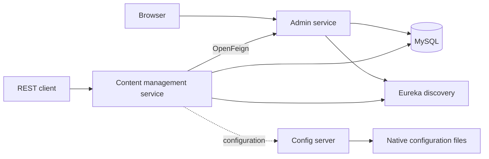

# MBHONI Enterprise Services

MBHONI ES is a Java microservice project for multi-tenant enterprise administration and tenant content management. It includes a web administration portal, REST APIs, centralized configuration, and service discovery.

The four services are independent Maven applications. There is no root Maven aggregator, separate frontend build, or standalone API gateway.

## Architecture

| Component | Responsibility | Intended port |
| --- | --- | --- |
| `config-server` | Spring Cloud Config Server with native filesystem configuration | `8888` |
| `eureka-server` | Service registration and discovery | `8761` |
| `admin-service` | Administration portal, identity, tenants, billing, and integration APIs | `8081` |
| `content-management-service` | Tenant content APIs and Feign client for admin metrics | `8080` |
| MySQL | Shared `mbhoni_es` database in Compose | Host `3307`; container `3306` |



Admin's packaged configuration defaults to **8080**, while shared configuration specifies **8081**. Explicitly set the admin port locally to avoid a collision. Central configuration is only partially wired into the current applications; see the Docker notes below.

## Features

- Tenant onboarding, settings, branding, quotas, and organization units.
- Users, roles, permissions, API keys, form login, Google OAuth configuration, and password reset flows.
- Subscription plans, module entitlements, billing accounts, expenses, invoices, quotations, contracts, and service catalog management.
- Employee records, configurable fields, completeness reports, payslips, and document exports.
- Tenant about information, media URLs, and product information through REST endpoints.
- Eureka discovery and Feign-based communication between content and admin.

Business modules are implemented primarily inside admin-service; they are not separate deployable microservices in this repository.

## Technology stack

| Area | Configuration |
| --- | --- |
| Java | JDK 25 |
| Spring Boot | `3.5.16` |
| Spring Cloud | `2025.0.3` |
| Build | Maven, with one POM per service |
| Persistence | MySQL, Spring Data JPA, Hibernate; H2 for admin tests |
| Migrations | Flyway in admin-service |
| UI | Thymeleaf, Bootstrap, JavaScript, CSS |
| Communication | OpenFeign and Spring Cloud LoadBalancer |
| Packaging | Executable JARs and Docker images |

## Repository layout

```text
mbhoni-es/
|-- admin-service/                 # Portal, APIs, business logic, migrations, tests
|-- content-management-service/    # Content REST API and admin Feign client
|-- config-server/
|   |-- config/                    # Native configuration used by local Compose
|   `-- src/                       # Config Server application
|-- eureka-server/                 # Service discovery application
|-- config/                        # Alternative configuration set for Git-backed use
|-- .github/workflows/             # JAR builds and Docker publishing
|-- docker-compose.yml             # Images built from local service JARs
|-- docker-compose-cloud.yml       # Published image references
|-- Dockerfile                     # Docker/Compose runner
`-- Dockerfile.koyeb               # Alternative Compose runner
```

Admin Java sources are under `admin-service/src/main/java/com/mbhoni_creative/`, organized into controllers, DTOs, entities, repositories, services, configuration, and security. Templates and static assets are under `src/main/resources/`.

## Local development

### Prerequisites

- JDK 25 and Maven 3.9+ on your PATH.
- MySQL 8, or Docker with Compose for the provided database container.
- Git.

The following commands use PowerShell and run from the repository root. Use a **disposable development database**: content-service startup currently calls `userRepo.deleteAll()` before creating its demo account. Do not start it against user data you need to retain.

### 1. Prepare the database and environment

```powershell
docker compose up -d mysql
docker compose ps mysql
Copy-Item admin-service/.env.example .env
```

Edit `.env`. For Compose MySQL, use `localhost:3307` in `DB_URL` and match the password configured in `docker-compose.yml`. Retain the JDBC query parameters from the example. For your own MySQL instance, use its host, port, database, and credentials instead.

| Variable | Purpose |
| --- | --- |
| `DB_URL`, `DB_USERNAME`, `DB_PASSWORD` | Admin database connection |
| `JPA_DDL_AUTO` | Hibernate schema behavior; defaults to `update` |
| `MAIL_USERNAME`, `MAIL_PASSWORD`, `MAIL_FROM` | SMTP credentials and sender |
| `APP_ADMIN_EMAIL` | Administrator email |
| `GOOGLE_CLIENT_ID`, `GOOGLE_CLIENT_SECRET` | Google OAuth credentials |

Admin loads `.env` relative to its working directory. Other services do not automatically load this file, and Compose does not automatically inject its variables into containers. Email and Google sign-in need valid provider settings. `.env` is ignored by Git.

### 2. Build all services

```powershell
mvn -f config-server/pom.xml clean package
mvn -f eureka-server/pom.xml clean package
mvn -f admin-service/pom.xml clean package
mvn -f content-management-service/pom.xml clean package
```

These commands run available tests and generate JARs in each service's `target/` directory. Resolve build failures before proceeding. Service Dockerfiles copy these JARs; they do not build source code.

### 3. Start infrastructure

Run each long-running command in its own terminal, with the repository root as the working directory.

Config Server:

```powershell
java -jar config-server/target/config-server-0.0.1-SNAPSHOT.jar --spring.cloud.config.server.native.search-locations=file:./config-server/config/
```

Eureka:

```powershell
java -jar eureka-server/target/eureka-server-0.0.1-SNAPSHOT.jar
```

The native search location overrides the container default, `file:/app/config`.

### 4. Start admin-service

```powershell
java -jar admin-service/target/admin-service-0.0.1-SNAPSHOT.jar --server.port=8081 "--spring.config.import=optional:file:.env[.properties]"
```

This explicitly loads the local environment file and bypasses the Config Server import, whose client dependency is currently missing from admin's POM. Admin's packaged Eureka URL points to `localhost:8761`.

Open [the admin login page](http://localhost:8081/login). The initializer seeds these development accounts when their passwords are absent:

| Account | Username | Initial password |
| --- | --- | --- |
| Global administrator | `mbuso` | `password123` |
| Tenant administrator | `jusaqua_admin` | `aqua123` |

Existing passwords are preserved. Change demo credentials before a shared deployment.

### 5. Start content-management-service

This local example disables Config Client and supplies settings explicitly. Replace the password with your development database password in this terminal.

```powershell
$env:SPRING_DATASOURCE_PASSWORD = '<your-local-database-password>'
java -jar content-management-service/target/content-management-service-0.0.1-SNAPSHOT.jar --spring.cloud.config.enabled=false --spring.application.name=content-management-service --server.port=8080 --spring.datasource.url="jdbc:mysql://localhost:3307/mbhoni_es?useSSL=false&allowPublicKeyRetrieval=true&serverTimezone=UTC" --spring.datasource.username=root --spring.jpa.hibernate.ddl-auto=update --eureka.client.service-url.defaultZone=http://localhost:8761/eureka/
```

Startup seeds `tenant1` content and recreates a demo user. The user deletion noted above is existing application behavior.

### 6. Check the services

- [Config Server health](http://localhost:8888/actuator/health)
- [Served content configuration](http://localhost:8888/content-management-service/default)
- [Eureka dashboard](http://localhost:8761/)
- [Admin login](http://localhost:8081/login)
- [Content status](http://localhost:8080/api/content/status)
- [Seeded content](http://localhost:8080/api/content/tenant1)

Allow time for Eureka registration. Admin currently has no Actuator starter, so its configured health URL is not a reliable readiness endpoint.

## Configuration and Docker

`config-server/config/` is copied or mounted into Config Server by the local Docker setup. Top-level `config/` contains a separate configuration set, including Git-backend settings. The two directories are not synchronized. A repository file named `config-server.yml` does not automatically configure the server's own startup backend.

The checked-in Compose files need the following adjustments before the full stack can start reliably:

1. **Admin configuration:** add the Config Client starter if central configuration is intended, and import `http://config-server:8888` inside Docker. Alternatively remove the Config Server import and supply application settings explicitly.
2. **Content configuration:** supply `SPRING_APPLICATION_NAME=content-management-service` and `SPRING_CONFIG_IMPORT=optional:configserver:http://config-server:8888`, or disable Config Client and provide the settings explicitly. There is no packaged content application configuration.
3. **Admin readiness:** Compose waits for `/actuator/health`, but admin's POM lacks the Actuator starter. Add it or choose an appropriate readiness check.
4. **Probe tools:** local health checks invoke `curl`; Dockerfiles do not explicitly install it. Ensure it is available in the built images.
5. **Cloud Compose:** config/admin dependencies require healthy containers without defining their health checks. Its Git environment settings also need an explicit backend/profile selection because Config Server defaults to `native`.

After resolving these items and building the JARs:

```powershell
docker compose config
docker compose up -d --build
docker compose ps
docker compose logs -f admin-service content-management-service
docker compose down
```

The named MySQL volume survives `docker compose down`. Adding `--volumes` deletes the persisted database.

`docker-compose-cloud.yml` references published Docker Hub images; inspect its exact tags before deployment. The root Dockerfiles run Compose inside a container and require a compatible Docker runtime. They are not individual service images or a verified hosting recipe.

## API overview

| Service | Method and path | Purpose |
| --- | --- | --- |
| Admin | `GET /api/admin/status` | Admin status |
| Admin | `GET /api/admin/tenant-metrics/{id}` | Tenant metrics |
| Admin | `GET /api/user/profile` | Current user's profile |
| Admin | `GET /api/user/profile/{id}` | User profile subject to access checks |
| Content | `GET /api/content/status` | Status message |
| Content | `GET /api/content/{tenantId}` | About, media, and product values |
| Content | `POST /api/content/about/{tenantId}` | Store an about string |
| Content | `POST /api/content/media/{tenantId}` | Store a media URL string, not a file upload |
| Content | `POST /api/content/products/{tenantId}` | Store product information as a string |
| Content | `GET /api/loadbalanced-metrics/{tenantId}` | Call admin through Feign and Eureka |

Content CRUD expects identifiers such as `tenant1` and `tenant2`. Admin entities have their own IDs; do not assume the formats are interchangeable.

```powershell
Invoke-RestMethod http://localhost:8080/api/content/tenant1
Invoke-RestMethod -Method Post -Uri http://localhost:8080/api/content/about/tenant1 -ContentType 'text/plain' -Body 'About our business'
```

Content currently permits unauthenticated access to all `/api/content/**` routes, including writes. Its metrics route requires authentication and the configured `X-API-Key`. The Feign interceptor contains demo credentials, while admin uses its own API-key and session security. Align credentials, authorization, and tenant IDs before relying on metrics integration end to end.

## Database migrations

Admin's Flyway migrations live in `admin-service/src/main/resources/db/migration/`. Flyway is enabled with baseline version `0`. Legacy `schema.sql` initialization is disabled; historical scripts remain under `admin-service/Database/`.

Hibernate defaults to `update` while legacy schemas are reconciled. Set `JPA_DDL_AUTO=validate` once the database matches the migrations. Add new versioned migrations instead of editing already-applied ones. Back up existing data before migration or repair work and preserve successful migration history.

## Tests and CI

```powershell
mvn -f admin-service/pom.xml test
mvn -f eureka-server/pom.xml test
mvn -f config-server/pom.xml test
mvn -f content-management-service/pom.xml test
```

Admin tests cover controllers, services, tenant access/context, repository isolation, and employee field behavior. Available tests vary by service; these commands do not imply full-stack integration coverage.

- `.github/workflows/build-jars.yml` builds all four services with tests skipped and force-adds generated JARs back to `main`.
- `.github/workflows/docker-build.yml` builds with tests skipped and publishes Docker Hub images using `DOCKERHUB_USERNAME` and `DOCKERHUB_TOKEN` repository secrets.

Run tests before submitting changes; publishing success does not establish that tests passed.

## Troubleshooting

| Symptom | Check |
| --- | --- |
| Java compilation/release error | Ensure `java -version` and `mvn -version` use JDK 25. |
| Port 8080 collision | Start admin with `--server.port=8081`. |
| Database connection failure | Use `localhost:3307` from the host or `mysql:3306` between containers. |
| Config import error | Check the Config Client dependency and import/disable settings above. |
| Config Server returns no properties | Check its native directory and requested application name. |
| Compose waits indefinitely for admin | Resolve its health endpoint and probe tooling. |
| Metrics returns 401, 404, or 5xx | Check discovery, credentials, authorization, and tenant ID compatibility. |
| Users disappear after content starts | Inspect the startup runner's `userRepo.deleteAll()` before restarting against shared data. |
| Flyway blocks startup | Inspect the failed migration and database state before repairing history. |

See [the admin-service guide](admin-service/README.md) for additional domain documentation. Where its examples differ, current source configuration and controller implementations take precedence.
